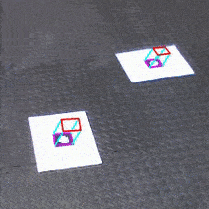

## Project - AR-Tag detection and Projection of virtual cubes
This project is an implementation of AR-tag detection and Placing a virtual cube over the tag

<em>Aruco Marker, Source: gfycat</em>

## Dataset
The video dataset for the project can be found here:
https://drive.google.com/drive/folders/1ij1_lzTf1-zFl5kzlxROlHquEemW4o3h

## Project dependencies
* Python 3.7
* opencv 3.4.2 
* imutils

## Executing the project
Intructions to run the project are mentioned in the report, can be found in `doc/PROJECT 1- ENPM 673.pdf`

## Results

Although the project goals are accomplished. The results can be greatly improved.

<em>AR-TagVirtual cube projection, Source: gfycat</em>

## References
The Project Goals and Summplementary material can be found in the `docs/`
